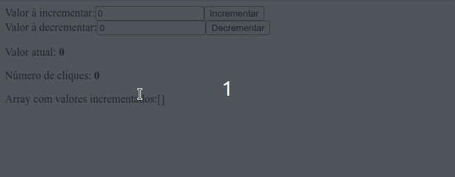

# Resultado final da aplicação


# Bônus
Agora você irá incrementar o código que foi feito durante a aula ao vivo.
* Faça um campo que recebe um valor e esse será o valor aplicado ao botão incremento.
* Faça um campo que recebe um valor e esse será o valor aplicado ao botão decremento.
* Armazene um outro valor no ```state``` , chamado ```clickCount``` . Este campo vai contar o número de vezes que qualquer botão na tela foi clicado.
* Armazene um ```array``` no ```state``` que guarda o valor individual que foi adicionado a cada click em qualquer um dos três botões.

## Observações
1. Por clareza decidi colocar nomes de variáveis um pouco fora do padrão, evitando usar o mesmo nome em variáveis/funções/estados
2. Optei por fazer o controle dos inputs e botões usando elementos do DOM (<strong>getElementsByName</strong>) para exercitar essa a bordagem.