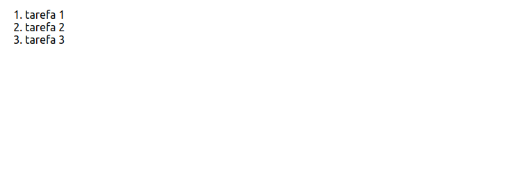

# Exercícios React
<p align=justify>1. Crie um novo projeto utilizando npx create-react-app nome-app e acesse a pasta nome-app
</p>
<p align=justify>
⚠️ Substitua o nome-app pelo que você desejar para seu app ⚠️
</p>
<p align=justify>
2. Crie uma lista de tarefas simples seguindo os passos abaixo:
</p>

* insira a função a seguir acima do seu App :

``` js
const task = (value) => {
  return (
    <li>{value}</li>
  );
}
```

* <p align=justify>agora, chame a função dentro do seu componente App (não se esqueça da sintaxe JSX!). Insira o valor que você quiser, salve a página e inicie-a rodando o comando npm start .</p>
* <p align=justify>por fim, crie uma array de compromissos e use a função map para que cada item do array apareça, como um item de lista, no seu componente App .</p>