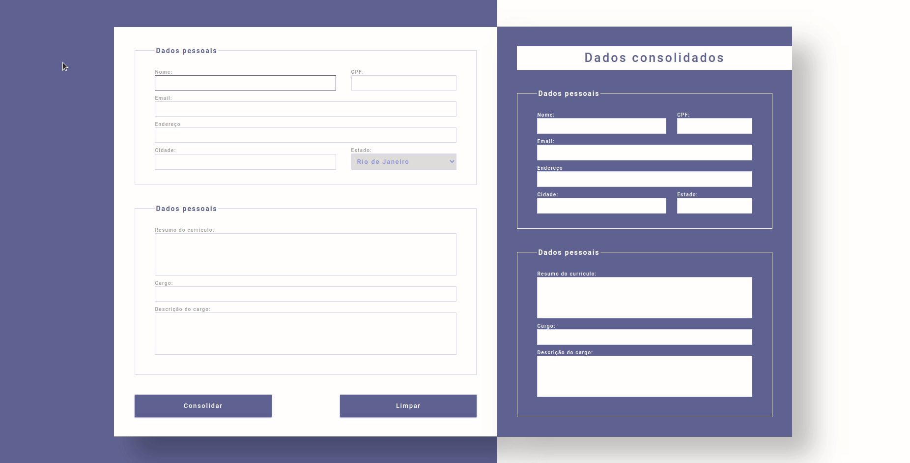

# Aplicação em execução:

# Criando um formulário em React .

Lembra do formulário que você criou usando JavaScript "clássico"? Vamos criar um parecido em React, e você verá como suas habilidades evoluíram desde então!

- Crie um novo projeto, utilizando npx create-react-app my-form-2.0
- Caso julgue necessário, crie estilos CSS para seu formulário, de acordo com a sua imaginação.
- Faça tudo utilizando as abstrações do React .

Vamos criar um formulário de cadastro de currículo com base na especificação seguintes:

i. Crie um `<fieldset>` para os dados pessoais a seguir:

1. Nome - Texto
    * Limite de 40 caracteres
    * Todos os caracteres devem ser transformados para UPPER CASE assim que forem digitados.
    * Campo obrigatório
2. Email - Texto
    * Limite de 50 caracteres
    * Campo obrigatório
3. CPF - Texto
    * Limite de 11 caracteres
    * Campo obrigatório
4. Endereço - Texto
    * Limite de 200 caracteres
    * Remover qualquer caracter especial que seja digitado
    * Campo obrigatório
5. Cidade - Texto
    * Limite de 28 caracteres
    * Ao remover o foco desse campo (evento onBlur ), verificar se o nome da cidade começa com números. Caso comece, limpar o campo.
    * Campo obrigatório.
6. Estado - ComboBox
    * Todos os estados do Brasil
    * Campo obrigatório.
7. Tipo - Radio Button
    * Casa, Apartamento
    * Campo obrigatório.

ii) Crie outro `<fieldset>` para dados do seu último emprego:
1. Resumo do currículo - TextArea
    * Limite de 1000 caracteres
    * Campo obrigatório.
2. Cargo - TextArea
    * Limite de 40 caracteres
    * Quando o mouse passar por cima deste campo (evento onMouseEnter ), exibir um alerta dizendo `Preencha com cuidado esta informação!`. ***Exiba essa mensagem apenas uma vez.***
    * Campo obrigatório
3. Descrição do cargo - Texto
    * Limite de 500 caracteres
    * Campo obrigatório
4. Crie um botão que, ao ser clicado, monta uma `
` com o consolidado dos dados que foram inseridos no formulário.
5. Crie um botão Limpar que limpa todos os campos do formulário e a `
` com seu currículo também.
