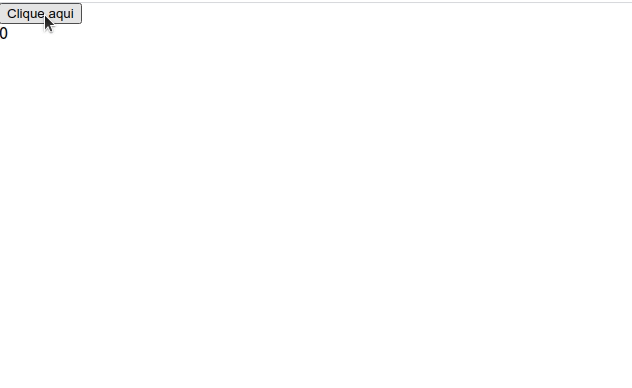

# Resultado final da aplicação

# Exemplo de Aula

## Contador de cliques

Vamos utilizar de exemplo um contador de cliques para criar os testes, rode os comandos e faça as alterações necessárias nos arquivos descritos.

Crie o contador a partir de 
<code>npx create-react-app</code> e após instale o redux e o react-redux com o comando <code>npm install --save redux react-redux</code>. Agora crie e/ou altere os arquivos

