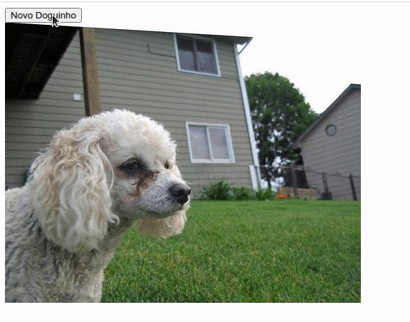

# Resultado final da aplicação


# Exemplo de Aula

## To do list
<p align="justify">
Agora, será feito os testes na aplicação de obter imagens de doguinhos. Essa aplicação utilizxa uma API e precisa usar estruturas assíncronas.
</p>
<p align="justify">
Aqui nós usamos a biblioteca fetch-mock-jest para facilitar a nossa execução de testes assíncronos! É perfeitamente possível fazer os testes sem ela também, mas fica como sugestão para experimentarem!

Para instalar a biblioteca:

```
npm install --save-dev jest-fetch-mock
```

</p>
