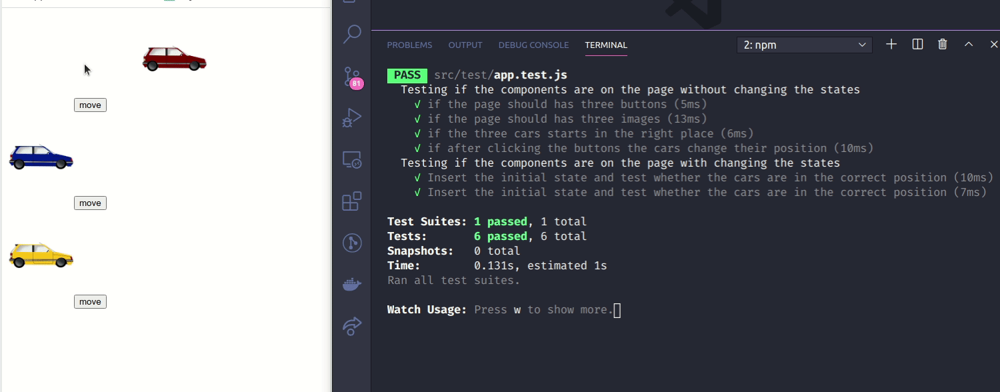

# Aplicação em execução:

Esse é um projeto para o conteúdo da semana 16, sobre `Testes em Redux com react`.

## COMEÇANDO OS EXERCÍCIOS

Crie os testes para a aplicação criada no exercício 2 do dia 16.2 . Sinta-se livre para criar data-testid. Teste se as informações foram devidamente renderizadas na tela.
Dica: Use o Redux Devtools para ver o estado da sua aplicação em seu navegador.

## Exercício 2 do dia 16.2

Como segunda tarefa, você deve usar o **Redux** para gerenciar o estado do componente `Cars`. As funções `mapStateToProps` e `mapDispatchToProps` devem ser usadas para conectar o componente ao estado do **Redux**.
Seu reducer deve ter 3 estados, `redCar`, `blueCar` e `yellowCar` e os 3 devem ser booleanos. Ao clicar no botão `Move`, o estado de seu respectivo carro deve mudar para que o carro ande. Já fizemos todo o CSS para que você se preocupe apenas com a lógica do exercício, ele encontra-se no arquivo `App.css`.
