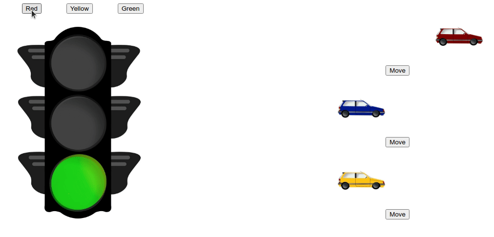

# Aplicação em execução:

<strong>Exercício 2:</strong> Refatore o exercicio <i >exercício 1.3 do dia 16.2</i>. Assim como no exercício anterior, a estrutura da aplicação estará pronta. Modifique a aplicação para utilizar Context API para gerenciar estado no lugar do Redux.

---

#### Exercício 1.3 do dia 16.2

Você deve juntar seus 2 reducers anteriores em um único reducer, usando o `combineReducers`. Talvez haja uma mudança no estado de seu reduce, então certifique-se que ambos os componentes continuem funcionando após a união.

