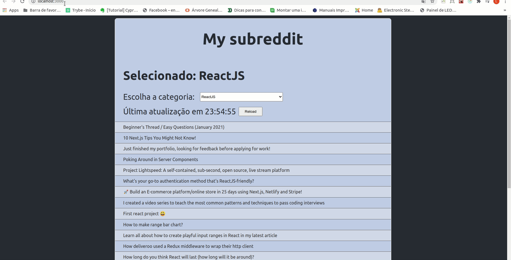

# Aplicação em execução:

<strong>Exercício 3:</strong> Refatore o exercicio <i >exercício 1.3 do dia 16.2</i>. Assim como no exercício anterior, a estrutura da aplicação estará pronta. Modifique a aplicação para utilizar Context API para gerenciar estado no lugar do Redux.

Exercício 3 Refatore o exercício Bônus do dia 16.4, que é sobre o Reddit, alterando a aplicação para utilizar Context API para gerenciar o estado no lugar de Redux.
---

# Bônus do dia 16.4

Como Redux exige muita prática, eis aqui mais um exercício! Desta vez, um mini-projeto para se desenvolver e guardar no portfólio!

Conhece o Reddit? É uma comunidade na qual pessoas conseguem criar grupos de discussão acerca de algum assunto. Tal grupo é chamado de subreddit. Para cada subreddit pessoas podem fazer postagens ( posts ). Como exercício, você vai fazer uma aplicação que permite a quem usá-la ver posts referentes a 2 subreddits :

1. reactjs
2. frontend

Sua aplicação deve permitir a quem usá-la poder escolher de qual subreddit se deseja ver as postagens. No momento que selecionar o subreddit , uma requisição precisa ser feita no reddit para buscar os posts referentes ao subreddit escolhido. Para cada postagem você precisa mostrar pelo menos o título do post. Além disso, sua aplicação deve permitir a quem usá-la a possibilidade de atualizar a lista de postagens referentes ao subreddit escolhido.

É obrigatório que você gerencie o estado de sua aplicação com Redux , guardando os subreddits , assim como os posts de cada subreddit , no store. Você precisa fazer uso do redux-thunk para permitir criar actions assíncronas.

## Pontos importantes:

1. 
Para buscar os posts referentes a um subreddit , você pode fazer uma requisição GET para https://www.reddit.com/r/<subreddit>.json. Ou seja, se você precisar buscar posts do subreddit reactjs , você faria uma chamada para https://www.reddit.com/r/reactjs.json.

2. 
No json retornado você encontra os dados referentes aos posts dentro da propriedade data.children. Para cada post dentro de data.children você encontra seu título correspondente na propriedade data.title.

3. 
Antes de começar a sair implementando, pare e pense sobre como desenhar o estado da sua aplicação. O que você precisa guardar no estado? Como você vai estruturar e organizar seus dados? Quais actions você precisa ter para modelar os eventos que ocorrerão na sua aplicação (fazer uma requisição, obter sua resposta, atualizar a lista, etc...)? Como você vai organizar seus reducers (lembrando que NUNCA deve-se alterar o estado, e sim criar um novo )?

4. 
Como você está fazendo uma requisição de um recurso externo, o que acontece se a requisição de postagens referentes a um subreddit falhar? Adicione na sua aplicação tratamento de erro para esses casos, salvando no estado da sua aplicação a mensagem de erro para o subreddit correspondente. Dica: procure e investigue no Google como fazer tratamento de erro de requisição no contexto de Redux.

5. 
Como forma de ter um melhor diagnóstico sobre o fluxo de dados em uma aplicação Redux , instale o middleware redux-logger e o integre na sua aplicação.

6. 
Instale a extensão do Chrome redux-dev-tools e a integre na sua aplicação. Com isso, você tem um ambiente completo para poder analisar e depurar sua aplicação. 🚀

