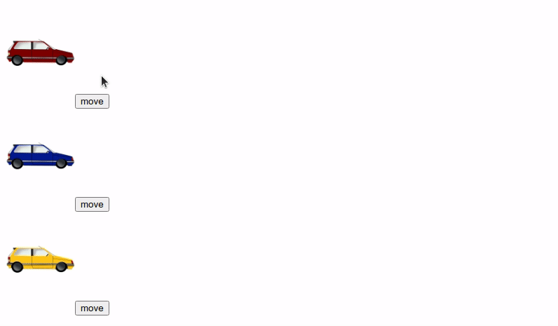

# Aplicação em execução:

<strong>Exercício 1 :</strong> Refatore o <i >exercício 1 do dia 18.1</i> substituindo toda a lógica de classes para a lógica de React Hooks , deixando todos os componentes funcionais.

---

### Exercício 1 do dia 18.1

Esse exercício 1 do dia 18.1 é baseado no exercício 1.2 do dia 16.2.

Você deve usar o **Redux** para gerenciar o estado do componente `Cars`. As funções `mapStateToProps` e `mapDispatchToProps` devem ser usadas para conectar o componente ao estado do **Redux**.

Seu reducer deve ter 3 estados, `redCar`, `blueCar` e `yellowCar` e os 3 devem ser booleanos. Ao clicar no botão `Move`, o estado de seu respectivo carro deve mudar para que o carro ande. Já fizemos todo o CSS para que você se preocupe apenas com a lógica do exercício, ele encontra-se no arquivo `App.css`.
