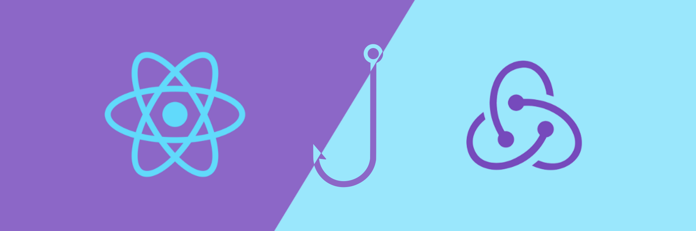

# Módulo 2 - Desenvolvimento Front-end

## Descrição

      Aqui você vai aprender as técnicas e ferramentas mais atuais para desenvolver um código de front-end que seja rápido, bonito e testável.

## Sumário
- [Módulo 2 - Desenvolvimento Front-end](#módulo-2---desenvolvimento-front-end)
- [Descrição](#descrição)
- [Sumario](#sumário)
- [Tecnologias utilizadas nesse módulo](#tecnologias-utilizadas-nesse-módulo)
- [Conteúdos abordados nesse módulo](#Conteúdos-abordados-nesse-módulo)

## Tecnologias utilizadas nesse módulo
- HTML 5
- CSS 3
- Javascript
- React
- Redux

## Conteúdos abordados nesse módulo
1. Bloco 11 - Introdução à React
2. Bloco 12 - Componentes com Estado, Eventos e Formulários com React
3. Bloco 13 - Ciclo de Vida de Componentes e React Router
4. Bloco 14 - Metodologias Ágeis
5. Bloco 15 - Testes automatizados com React Testing Library
6. Bloco 16 - Gerenciamento de estado com Redux
7. Bloco 17 - Projeto Jogo de Trivia
8. Bloco 18 - Context API e React Hooks
9. Bloco 19 - Projeto App de Receitas