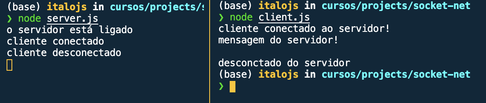

# Como testar a aplicação

Abra o terminal e levante o servidor com o comando abaixo

```bash
$ node server.js
```

Após o servidor estar em pé, abra outro terminal e execute o seguinte comando
```bash
$ node client.js
```

Se tudo correu bem voce deverá ter a seguinte saída nos terminais


