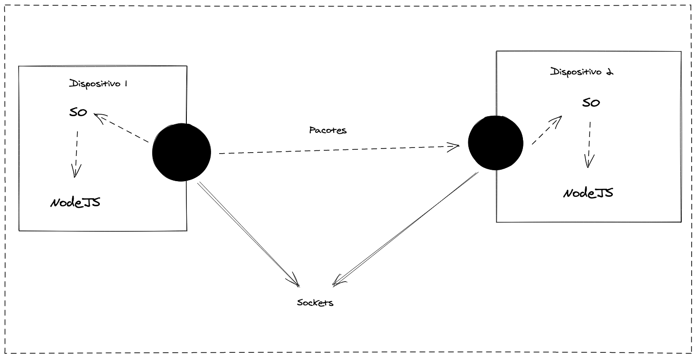
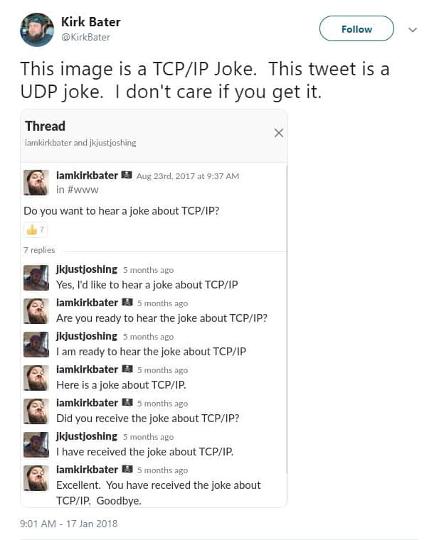
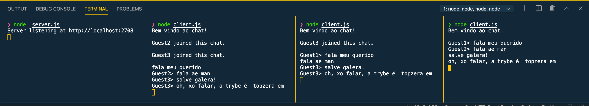

---
presentation:
  previewLinks: true
  height: 1080
  width: 1920
---

<!-- slide -->

# 31.2: Sockets - TCP, UDP e pacote `net`

<!-- slide -->

## Sockets

<!-- slide vertical=true -->

> "Um Socket é um ponto final (endpoint) de um canal bidirecional de comunicação entre dois programas rodando em uma rede;"

<!-- slide vertical=true -->

<!-- slide -->

## TCP vs UDP

<!-- slide vertical=true -->

<!-- slide -->

## TCP

<!-- slide vertical=true -->

- Hand-shake
- Verificação de integridade
- Reenvio de pacotes

<!-- slide -->

## UDP

<!-- slide vertical=true -->

# Pronto ou não aí vai um pacote! 

[Gif](https://media.giphy.com/media/R56D9r7oGPx96/giphy.gif)

<!-- slide -->

# Construindo um chat

<!-- slide vertical=true -->

# Show me the code!