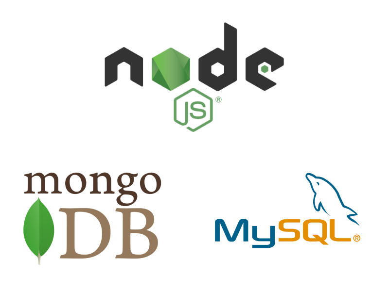

# Módulo 3 - Desenvolvimento Back-end

## Descrição

      Neste módulo, você vai aprender como desenvolver um código de back-end robusto, limpo, escalável e seguro, dominando o uso de bancos de dados, a construção de APIs com testes automatizados.

## Sumário
- [Módulo 3 - Desenvolvimento Back-end](#módulo-3---desenvolvimento-back-end)
- [Descrição](#descrição)
- [Sumario](#sumário)
- [Tecnologias utilizadas nesse módulo](#tecnologias-utilizadas-nesse-módulo)
- [Conteúdos abordados nesse módulo](#Conteúdos-abordados-nesse-módulo)

## Tecnologias utilizadas nesse módulo
- MySQL
- MongoDB
- NodeJS
- Arquitetura Rest e Restful
- Arquitetura SOLID e ORM

## Conteúdos abordados nesse módulo
1. Bloco 20: Introdução à SQL
2. Bloco 21: Funções SQL, Joins e Subqueries
3. Bloco 22: Normalização e Modelagem de Banco de Dados
4. Bloco 23: Introdução ao MongoDB
5. Bloco 24: MongoDB: Updates Simples e Complexos
6. Bloco 25: MongoDB: Aggregation Framework
7. Bloco 26: Introdução ao desenvolvimento Web com NodeJS
8. Bloco 27: NodeJS: Camada de Serviço e Arquitetura Rest e Restful
9. Bloco 28: Autenticação e Upload de Arquivos
10. Bloco 29: Deployment
11. Bloco 30: Projeto Trybeer
12. Bloco 31: Arquitetura: SOLID e ORM
13. Bloco 32: Sockets
14. Bloco 33: Projeto Trybeer II
