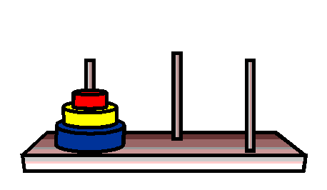

# Agora, a prática

Vamos juntar tudo o que aprendemos até aqui e exercitar mais ainda nosso aprendizado!

## Exercício 1:

Crie um algoritmo não recursivo para contar quantos números pares existem em uma sequência numérica (1 a n).

### Resposta

```python
def conta_pares(n):
    numero_de_pares = 0
    for num in range(n+1):
        if num % 2 == 0 and num != 0:
            numero_de_pares += 1
    return numero_de_pares
```

## Exercício 2:

Transforme o algoritmo criado acima em recursivo.

### resposta

```python
def conta_pares(n):
    if n == 1:
        return 0
    elif n % 2 == 0:
        return 1 + conta_pares(n-1)
    else:
        return conta_pares(n-1)
```

## Exercício 3:

Crie um algoritmo recursivo que encontre, em uma lista, o maior número inteiro.

```python
def maiorinteiro_aux(lista, tamanho):
    if tamanho == 1:
        return lista[0]
    else:
        maior_do_resto_da_lista = maiorinteiro_aux(lista, tamanho-1)
        if maior_do_resto_da_lista > lista[tamanho-1]:
            return maior_do_resto_da_lista
        else:
            return lista[tamanho-1]


def maiorinteiro(lista):
    tamanho = len(lista)
    return maiorinteiro_aux(lista, tamanho)


print(maiorinteiro([1, 21, 300, 4, 57]))
```

## Exercício 4:

Escreva um algoritmo recursivo para encontrar o máximo divisor comum ( `mdc` ) de dois inteiros.

### Resposta

```python
def mdc(a, b):
    if b == 0:
        return a
    return mdc(b, a % b)
```

## Exercício 5:

Escreva um algoritmo recursivo que identifica se um número é primo.

### Resposta

```python
def temdivisor(n, i, j):
    if i > j:
        return False
    elif n % i == 0:
        return True
    else:
        return temdivisor(n,i + 1,j)


def primo(n):
    return n > 1 and not(temdivisor(n, 2, n - 1))


print(primo(997))
```

# Bônus
## Exercício 6:

Escreva um algoritmo recursivo que resolva o problema da torre de hanoi, seguindo as instruções:
* Assim como na imagem abaixo, a torre deve conter 3 discos, e três colunas;
* Os discos começam alinhados na primeira coluna, e devem ser organizados respeitando a ordem de tamanho, na última coluna.


### Resposta

```python
def torres_hanoi(numero_de_discos, a, b, c):
    if numero_de_discos == 1:
        print ("Move disco %d de %s para %s" % (numero_de_discos, a, c))
    else:
        torres_hanoi(numero_de_discos - 1,a ,c ,b)
        print ("Move disco %d de %s para %s" % (numero_de_discos, a, c))
        torres_hanoi(numero_de_discos - 1, b, a, c)


print (torres_hanoi(3, a='primeiro', b='meio', c='fim'))
```